# DEVOTEAM KATA

A full-stack application with a React + Vite frontend, Spring Boot backend, and PostgreSQL database.

## Project Overview

This project provides an event reservation system with JWT authentication, SSE updates, and scheduled cleanup of expired reservations.

## Key Features

- JWT-based authentication (access + refresh tokens)
- Event listing and reservation flow
- Real-time seat updates via SSE
- Scheduled cleanup of expired reservations
- Hexagonal/clean architecture separation

## Architecture

### 1) General Architecture (Frontend -> Backend -> Database)

```mermaid
flowchart LR
    U[User Browser] --> C[Client App<br/>React + Vite + Bun]
    C -->|HTTPS REST /api/v1| B[Backend API<br/>Spring Boot]
    C <-->|SSE /api/v1/events/{eventId}/stream| B
    B -->|JPA/Hibernate| D[(PostgreSQL)]
    B -->|JWT Access/Refresh| C
    B -->|Scheduled cleanup job| D
```

### 2) Backend Packages and Key Classes

Package diagram (layers left → right). Dependencies: config → adapter.in → application → domain ← adapter.out.

```mermaid
flowchart LR
    subgraph CFG["config + security"]
        direction TB
        CONF[CorsConfig, OpenApiConfig<br/>RestExceptionHandler, RequestLoggingFilter]
        SECF[SecurityConfig, JwtAuthFilter]
    end

    subgraph ADI["adapter.in"]
        direction TB
        REST[AuthController, EventController<br/>ReservationController]
        SSEI[RoomSseController]
        SCH[ReservationCleanupJob]
        CLI[SeedDataCommand, CleanDataCommand]
    end

    subgraph APP["application"]
        direction TB
        PORTIN[port.in: Use Cases]
        SVC[AuthService, EventQueryService, SeatQueryService<br/>ReservationCommandService, ReservationQueryService]
        PORTOUT[port.out: TokenProvider, RoomUpdatePublisher<br/>PasswordHasher, ClockPort, RefreshTokenStore]
        DTO[dto]
    end

    subgraph DOM["domain"]
        direction TB
        MODEL[Event, Room, Seat<br/>Reservation, User]
        REPO[repository interfaces]
        DSRV[ReservationPolicy]
        DEVT[RoomChangeEvent]
    end

    subgraph ADO["adapter.out"]
        direction TB
        JPAA[persistence.jpa.adapter]
        JPAE[persistence.jpa.entity]
        JPAR[persistence.jpa.repository]
        SEC[JwtTokenProvider, BCryptPasswordHasher<br/>SystemClockAdapter]
        SSEO[InMemoryRoomUpdatePublisher]
    end

    CFG --> ADI
    ADI --> APP
    APP --> DOM
    APP --> ADO
    ADO --> DOM
```



### 3) Backend Architecture (Clean/Hexagonal View)

```mermaid
flowchart LR
    subgraph INBOUND[Inbound Adapters]
        A1[REST Controllers]
        A2[SSE Controller]
        A3[Scheduler]
        A4[CLI Commands]
    end

    subgraph APP_CORE[Application Core]
        UC[Use Cases (port.in)]
        AS[Application Services]
        DP[Domain Model + Domain Services]
        OUTP[Output Ports (port.out)]
    end

    subgraph OUTBOUND[Outbound Adapters]
        O1[JPA Repository Adapters]
        O2[Security Adapters<br/>JWT/Password/Clock]
        O3[SSE Publisher Adapter]
    end

    subgraph INFRA[Infrastructure]
        DB[(PostgreSQL)]
    end

    INBOUND --> UC
    UC --> AS
    AS --> DP
    AS --> OUTP
    OUTP --> OUTBOUND
    OUTBOUND --> DB
```

## Quick Start (Docker)

To start everything with Docker (PostgreSQL + backend + client):

```bash
make run
```

This will:
- Start PostgreSQL
- Build the backend and client images
- Clean and seed the database
- Start the backend and client containers

- Backend API: http://localhost:8080
- Frontend (Docker): http://localhost:4200

Use `PROFILE=staging make run` (or another profile) to run with a different Spring profile.

## Local Development

### 1) Start the database

```bash
make up
```

### 2) Clean the database (optional)

```bash
make clean
```

### 3) Seed the database (first time)

```bash
make seed
```

### 4) Start the backend

```bash
make run-dev
```

Backend API: http://localhost:8080

### 5) Start the frontend

```bash
make frontend
```

Vite dev server: use the URL printed in the terminal (commonly http://localhost:5173).

## Project Layout

- devo_carre/ — Spring Boot backend
- client-application/ — React + Vite frontend
- compose.yaml — Docker Compose (postgres, backend, client)
- Makefile — Main entry point for all commands

## Useful Commands

| Command | Description |
|--------|-------------|
| `make help` | List all Make targets |
| `make up` | Start PostgreSQL only |
| `make seed PROFILE=dev` | Seed database (default profile: dev) |
| `make clean PROFILE=dev` | Clean all database data (requires confirmation) |
| `make run-dev PROFILE=dev` | Run Spring Boot locally |
| `make frontend` | Run React client locally |
| `make package` | Build backend JAR (skips tests) |
| `make bootstrap-images` | Start postgres, build backend/client images, clean+seed DB |
| `make run PROFILE=dev` | Full bootstrap + start Docker stack |

## Kubernetes (kind + Helm)

Local workflow using kind and the Helm charts:

```bash
make kind-bootstrap
```

This command will:
- Create a kind cluster (`devoteam-local`)
- Build and load backend/client Docker images into kind
- Deploy PostgreSQL in namespace `devoteam`
- Install/upgrade backend and client Helm releases

Expose postgres/frontend/backend to localhost:

```bash
make k8s-port-forward
```

- PostgreSQL: `localhost:5432`
- Frontend: http://localhost:4200
- Backend: http://localhost:8080
- Override local ports if needed: `make k8s-port-forward POSTGRES_PORT=5433 BACKEND_PORT=8081 CLIENT_PORT=4201`

Useful related commands:
- `make kind-status`
- `make k8s-seed` (one-shot backend seed job in-cluster)
- `make k8s-undeploy`
- `make kind-delete`
- `make helm-package`
- `make helm-push HELM_OCI_REPO=oci://<registry>/<repo>`

If `make kind-bootstrap` stalls while waiting for PostgreSQL, the updated make flow now re-enables scheduling on local kind nodes before waiting and prints node/pod status if PostgreSQL still cannot become available.
