# DEVOTEAM KATA

A full-stack application with a **React + Vite** frontend, **Spring Boot** backend, and **PostgreSQL** database.

## How to run the app (local)

1. **Start the database**
   ```bash
   make up
   ```

2. **Install frontend dependencies and start the client**
   ```bash
   cd client-application
   bun install   # or: npm install
   bun run dev   # or: npm run dev
   ```

3. **In another terminal, start the backend**
   ```bash
   make run-dev
   ```

Backend API: http://localhost:8080. Frontend: use the URL shown by the dev server (e.g. http://localhost:5173).

---

## Prerequisites

- **Docker** and **Docker Compose** (for running with containers)
- **Java 25** and **Maven** (for local backend)
- **Bun or Node** (for local frontend)

## Quick start (Docker)

To start everything with Docker (PostgreSQL + backend + client):

```bash
make run
```

This will:

1. Start PostgreSQL
2. Build the backend and client images
3. Clean and seed the database
4. Start the backend and client containers

- **Backend API:** http://localhost:8080  
- **Frontend:** http://localhost:4200

Use `PROFILE=staging make run` (or another profile) to run with a different Spring profile.

## Local development

### 1. Start the database

```bash
make up
```

This starts only PostgreSQL (port 5432).

### 2. Clean the database

```bash
make clean
```

### 3. Seed the database (first time)

```bash
make seed
```

Use `make seed PROFILE=staging` for another profile. To reset data: `make clean` then `make seed`.

### 3. Start the backend

```bash
make run-dev
```

Runs the Spring Boot app with the `dev` profile (default). Override with `make run-dev PROFILE=staging`. API is at http://localhost:8080.

### 4. Start the frontend

In another terminal:

```bash
make frontend
```

Runs the React app with Bun (e.g. Vite dev server). Use the URL shown in the terminal (http://localhost:4200).


## Other useful commands

| Command | Description |
|--------|-------------|
| `make help` | List all Make targets |
| `make up` | Start PostgreSQL only |
| `make seed PROFILE=dev` | Seed database (default profile: `dev`) |
| `make clean PROFILE=dev` | Clean all database data (requires confirmation) |
| `make run-dev PROFILE=dev` | Run Spring Boot locally |
| `make frontend` | Run React client locally |
| `make package` | Build backend JAR (skips tests) |
| `make bootstrap-images` | Start postgres, build backend/client images, clean+seed DB |
| `make run PROFILE=dev` | Full bootstrap + start Docker stack |

## Project layout

- **devo_carre/** — Spring Boot backend
- **client-application/** — React + Vite frontend
- **compose.yaml** — Docker Compose (postgres, backend, client)
- **Makefile** — Main entry point for all commands

## 1) General Architecture (Frontend -> Backend -> Database)

```mermaid
flowchart LR
    U[User Browser] --> C[Client App<br/>React + Vite + Bun]
    C -->|HTTPS REST /api/v1| B[Backend API<br/>Spring Boot]
    C <-->|SSE /api/v1/events/{eventId}/stream| B
    B -->|JPA/Hibernate| D[(PostgreSQL)]
    B -->|JWT Access/Refresh| C
    B -->|Scheduled cleanup job| D
```

## 2) Backend Packages and Key Classes

Package diagram (layers left → right). Dependencies: config → adapter.in → application → domain ← adapter.out.

```mermaid
flowchart LR
    subgraph CFG["config + security"]
        direction TB
        CONF[CorsConfig, OpenApiConfig<br/>RestExceptionHandler, RequestLoggingFilter]
        SECF[SecurityConfig, JwtAuthFilter]
    end

    subgraph ADI["adapter.in"]
        direction TB
        REST[AuthController, EventController<br/>ReservationController]
        SSEI[RoomSseController]
        SCH[ReservationCleanupJob]
        CLI[SeedDataCommand, CleanDataCommand]
    end

    subgraph APP["application"]
        direction TB
        PORTIN[port.in: Use Cases]
        SVC[AuthService, EventQueryService, SeatQueryService<br/>ReservationCommandService, ReservationQueryService]
        PORTOUT[port.out: TokenProvider, RoomUpdatePublisher<br/>PasswordHasher, ClockPort, RefreshTokenStore]
        DTO[dto]
    end

    subgraph DOM["domain"]
        direction TB
        MODEL[Event, Room, Seat<br/>Reservation, User]
        REPO[repository interfaces]
        DSRV[ReservationPolicy]
        DEVT[RoomChangeEvent]
    end

    subgraph ADO["adapter.out"]
        direction TB
        JPAA[persistence.jpa.adapter]
        JPAE[persistence.jpa.entity]
        JPAR[persistence.jpa.repository]
        SEC[JwtTokenProvider, BCryptPasswordHasher<br/>SystemClockAdapter]
        SSEO[InMemoryRoomUpdatePublisher]
    end

    CFG --> ADI
    ADI --> APP
    APP --> DOM
    APP --> ADO
    ADO --> DOM
```



## 3) Backend Architecture (Clean/Hexagonal View)

```mermaid
flowchart LR
    subgraph INBOUND[Inbound Adapters]
        A1[REST Controllers]
        A2[SSE Controller]
        A3[Scheduler]
        A4[CLI Commands]
    end

    subgraph APP_CORE[Application Core]
        UC[Use Cases (port.in)]
        AS[Application Services]
        DP[Domain Model + Domain Services]
        OUTP[Output Ports (port.out)]
    end

    subgraph OUTBOUND[Outbound Adapters]
        O1[JPA Repository Adapters]
        O2[Security Adapters<br/>JWT/Password/Clock]
        O3[SSE Publisher Adapter]
    end

    subgraph INFRA[Infrastructure]
        DB[(PostgreSQL)]
    end

    INBOUND --> UC
    UC --> AS
    AS --> DP
    AS --> OUTP
    OUTP --> OUTBOUND
    OUTBOUND --> DB
```